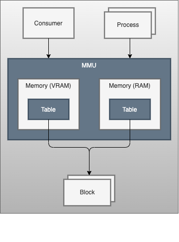
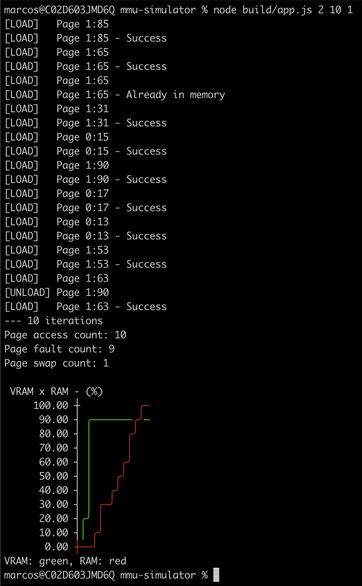

# mmu-simulator

Memory Management Unity simulator implemented in node.js using Typescript.

Application developed as workpaper for the Operational Systems class.
University of Vale do Rio dos Sinos, Brazil/Rio Grande do Sul

## Description
The application simulates the Memory Management Unity (MMU) job by having a limited physical memory (RAM), processes can be loaded into the virtual memory (VRAM) and each of them will be broken into several blocks of same size pre-defined.
All these blocks are primarily mapped in the virtual memory, once they are required, the MMU will load them in the physical memory.

### Architecture
The application uses the following classes to simulate the Memory Management Unity:
  * Process - defines the process having id and size
  * Block - defines a page from a process having both process and page ids
  * Table - defines a custom map used to reference the pages
  * Memory - defines a memory structure with the necessary functions (consumes a Table)
  * MemoryManagementUnity - defines the memory management structure with the necessary functions, having the block size and a Memory for each physical and virtual memories.

### How to run
To run the application you will need node.js and execute the app.js
  > node build/app.js

You can define some parameters in order to change the behavior, for example: node build/app.js {param1} {param2} {param3}
  * param1: number of processes (default = 2)
  * param2: number of page access iterations (default = 100)
  * param3: process size exponential distribution, bigger values generates smaller process sizes (default = 8)

  > node build/app.js 2 100 8

### Output
The code has an app that will mock processes and page access demand in order to let the MMU work.
The program will output the page access, fault and swap in the console.
In the end a graph will be showing the physical and virtual memory load during execution.
  * [LOAD] - Logged when a page is requested or successfully loaded, the log references a single page with the key {processId}:{blockId}
  * [UNLOAD] - Logged when a page is selected to be swapped out in order to give space for a new one that was required.

